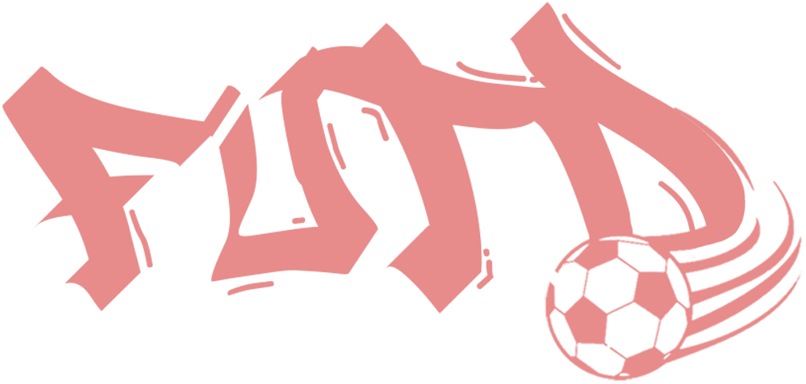

# FUTD

Este proyecto busca desarrollar una aplicación responsiva e intuitiva para el **Comité Organizador del Mundial Escolar de Fútbol**, diseñada para funcionar de manera fluida en smartphones, tablets, pantallas inteligentes y dispositivos wearables, utilizando una única base de código.

---

## 🎯 Objetivo

Brindar a los asistentes, participantes y organizadores del evento una plataforma única que permita:

- Consultar horarios y detalles de los partidos.
- Ver resultados en tiempo real desde cualquier dispositivo.
- Reservar lugares para partidos importantes.
- Acceder rápidamente a información general del torneo.

La aplicación debe adaptarse al tamaño y contexto de uso de cada dispositivo, priorizando la experiencia del usuario y la inmediatez en la entrega de información.

---|

## 🧩 Módulos Principales

### 1. Módulo de Horarios de Partidos
- Consulta por día, sede, fase del torneo o equipos.
- Detalles del partido: hora, lugar, equipos, grupo y árbitros.

### 2. Módulo de Reservación de Lugares
- Reserva anticipada para partidos destacados.
- Control de capacidad y confirmaciones.
- Notificaciones de recordatorio antes del evento.

### 3. Módulo de Resultados
- Actualización en tiempo real de marcadores y eventos.
- Tablas de posiciones por grupo o categoría.
- Estadísticas por equipo y jugador.

### 4. Módulo de Información General
- Noticias oficiales, reglamento y comunicados del comité.
- Información de sedes, mapas de ubicación y transporte.
- Preguntas frecuentes y medios de contacto.

---

## 📌 Características Relevantes

- **Diseño Responsivo:** Interfaz adaptable a cualquier tipo de pantalla, desde relojes hasta pantallas grandes.
- **Multidispositivo:** Experiencia coherente y sincronizada en todos los dispositivos.
- **Interactividad en Tiempo Real:** Información actualizada al instante para resultados y reservas.
- **Navegación Intuitiva:** Flujo de uso sencillo, accesible para usuarios de todas las edades.
- **Modularidad y Escalabilidad:** Arquitectura lista para integrar funcionalidades futuras como votaciones, rankings o transmisiones en vivo.

---

## 📄 Licencia

Este proyecto es propiedad del **Comité Organizador del Mundial Escolar de Fútbol** y su uso está restringido a fines autorizados por dicha entidad.
