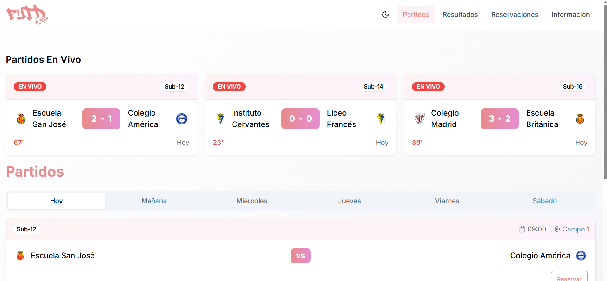
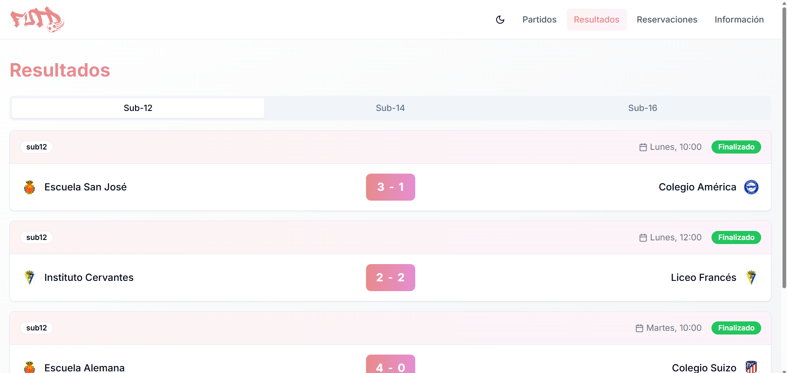

# ⚽ FUTD — Plataforma Oficial del Mundial Escolar de Fútbol

Este proyecto tiene como objetivo desarrollar una **aplicación responsiva e intuitiva** para el Comité Organizador del Mundial Escolar de Fútbol, bajo la iniciativa **FUTD**. Está diseñada para funcionar de manera fluida en **📱 smartphones, 💻 tablets, 🖥️ pantallas inteligentes y ⌚ dispositivos wearables**, utilizando una única base de código.

---

## 🎯 Objetivo

Brindar a los asistentes, participantes y organizadores del evento una plataforma única que permita:

- 🗓️ Consultar **horarios y detalles** de los partidos.
- 🔴 Ver **resultados en tiempo real** desde cualquier dispositivo.
- 🎟️ **Reservar lugares** para partidos importantes.
- 📚 Acceder rápidamente a **información general** del torneo.

> La aplicación debe adaptarse al tamaño y contexto de uso de cada dispositivo, **priorizando la experiencia del usuario y la inmediatez** en la entrega de información.

---

## 🧩 Módulos Principales

### 1️⃣ Módulo de Horarios de Partidos
🗂️ Consulta por día, sede, fase del torneo o equipos.  
📌 Detalles: hora, lugar, equipos, grupo y árbitros.

### 2️⃣ Módulo de Reservación de Lugares
🪪 Reserva anticipada para partidos destacados.  
📊 Control de capacidad y confirmaciones.  
🔔 Notificaciones de recordatorio antes del evento.

### 3️⃣ Módulo de Resultados
⏱️ Actualización en tiempo real de marcadores y eventos.  
📈 Tablas de posiciones por grupo o categoría.  
📊 Estadísticas por equipo y jugador.

### 4️⃣ Módulo de Información General
📰 Noticias oficiales, reglamento y comunicados del comité.  
🗺️ Información de sedes, mapas de ubicación y transporte.  
❓ Preguntas frecuentes y medios de contacto.

---

## ✨ Características Relevantes

- 💡 **Diseño Responsivo**: Interfaz adaptable a cualquier tipo de pantalla.
- 🔄 **Multidispositivo**: Experiencia coherente y sincronizada.
- ⚡ **Interactividad en Tiempo Real**: Resultados y reservas actualizados al instante.
- 🧠 **Navegación Intuitiva**: Flujo de uso sencillo, accesible para todas las edades.
- 🧱 **Modularidad y Escalabilidad**: Lista para integrar votaciones, rankings o transmisiones en vivo.

---

## 🛠️ Tecnologías Utilizadas

- ⚙️ **Next.js** – Framework React para SSR y SSG.
- 🧑‍💻 **TypeScript** – Tipado estático que mejora mantenimiento y escalabilidad.
- 🎨 **TailwindCSS** – Utilidades CSS para diseño responsivo.
- 🧩 **Radix UI** – Componentes accesibles y altamente personalizables.
- 🎞️ **Framer Motion** – Animaciones fluidas y naturales para React.

---

## 📱 Dispositivos Soportados y Consideraciones de Diseño

<table border="1">
  <thead>
    <tr>
      <th>Tipo de Dispositivo</th>
      <th>Tamaños Comunes (px)</th>
      <th>Consideraciones UX/UI</th>
    </tr>
  </thead>
  <tbody>
    <tr>
      <td>Smartphones</td>
      <td>360x640, 414x896, 390x844</td>
      <td>Diseño vertical, botones grandes, navegación simple</td>
    </tr>
    <tr>
      <td>Tablets</td>
      <td>768x1024, 800x1280</td>
      <td>Uso horizontal/vertical, tarjetas adaptables</td>
    </tr>
    <tr>
      <td>Laptops/PC</td>
      <td>1366x768, 1440x900, 1920x1080</td>
      <td>Diseño en cuadrícula, contenido distribuido, uso eficiente del espacio</td>
    </tr>
    <tr>
      <td>Pantallas Inteligentes</td>
      <td>1920x1080, 3840x2160</td>
      <td>Layout amplio, tipografía grande, controles por gestos o remoto</td>
    </tr>
    <tr>
      <td>Wearables</td>
      <td>390x390, 454x454</td>
      <td>Información mínima, navegación por gestos</td>
    </tr>
  </tbody>
</table>
 

---

## 🎨 Paleta de Colores

<table border="1">
  <thead>
    <tr>
      <th>Color</th>
      <th>Código Hex</th>
      <th>Uso Principal</th>
      <th>Justificación</th>
    </tr>
  </thead>
  <tbody>
    <tr>
      <td>Rosa Principal</td>
      <td>#E88B8B</td>
      <td>Elementos clave, logotipo, botones, títulos</td>
      <td>Color protagonista del evento. Actual, juvenil, amigable y diferente a los colores deportivos típicos. Refuerza identidad visual y frescura.</td>
    </tr>
    <tr>
      <td>Gris Claro</td>
      <td>#F5F5F5</td>
      <td>Fondos secundarios</td>
      <td>Aporta limpieza visual sin competir con el color principal. Mejora el contraste y da soporte a la jerarquía visual.</td>
    </tr>
    <tr>
      <td>Gris Oscuro</td>
      <td>#333333</td>
      <td>Textos, íconos oscuros</td>
      <td>Alta legibilidad, especialmente en temas claros. Complementa sin restar protagonismo al rosa principal.</td>
    </tr>
    <tr>
      <td>Blanco</td>
      <td>#FFFFFF</td>
      <td>Fondo principal</td>
      <td>Base neutra y profesional que potencia la visibilidad del color principal. Favorece la accesibilidad y el diseño limpio.</td>
    </tr>
  </tbody>
</table>
 

---

## 🖼️ Mockups y Prototipos

### 💻 Laptops/PC

#### 🗓️ Horarios

#### 📊 Resultados

#### 🎟️ Reservacion de lugares

### 📱 SmartPhones

#### 🗓️ Horarios

#### 📊 Resultados

#### 🎟️ Reservacion de lugares

### 📲 Tablet

#### 🗓️ Horarios

#### 📊 Resultados

#### 🎟️ Reservacion de lugares

### ⌚ Wearables

#### 🗓️ Horarios

### 🖥️ TV

#### 🗓️ Horarios

#### 📊 Resultados

---

## 🧪 Consideraciones de Usabilidad

- 👨‍👩‍👧 Interfaces diseñadas para usuarios de todas las edades.
- 🟢 Contraste accesible (cumplimiento WCAG AA/AAA).
- 📦 Soporte offline parcial (caché local para ciertas vistas).
- 🧭 Navegación intuitiva con accesos rápidos y breadcrumb.
- 👆 Elementos interactivos suficientemente grandes para pantallas táctiles.

---

## 📄 Licencia

Este proyecto es propiedad del **Comité Organizador del Mundial Escolar de Fútbol** bajo la iniciativa **FUTD**, y su uso está **restringido a fines autorizados** por dicha entidad.
